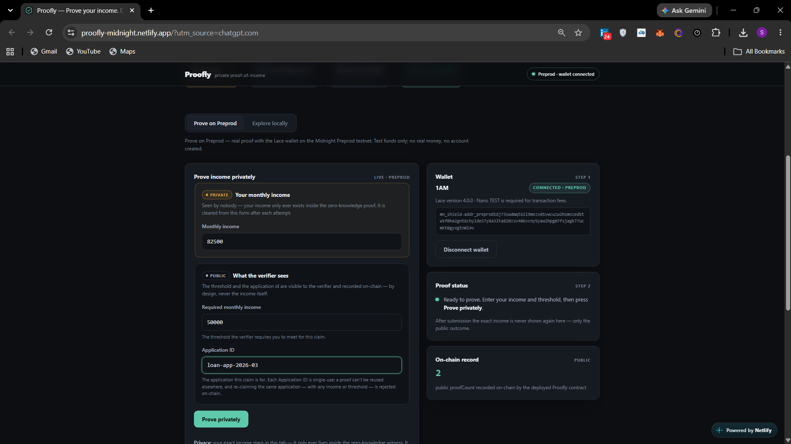
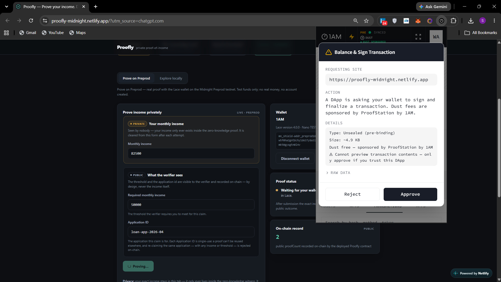
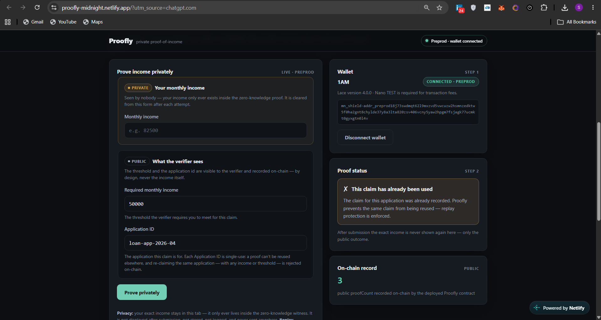
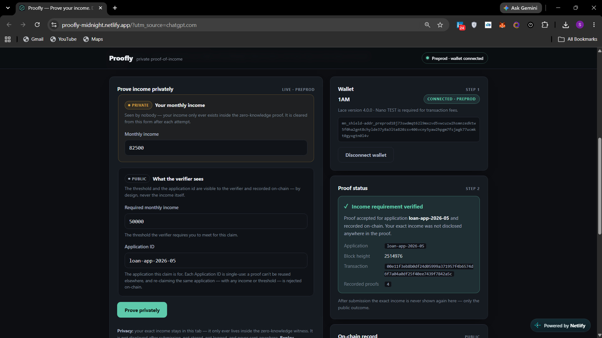
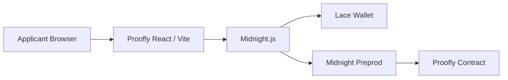

# Proofly

### Prove your income. Don't reveal your income.

Proofly lets an applicant prove that their **private monthly income satisfies a
required threshold** using a **Midnight zero-knowledge proof** — without ever
revealing the exact income to the verifier.


A single static React/Vite app runs two experiences: an offline **Local Demo**
and a **Live Proof** against the deployed Proofly contract on Midnight Preprod.

---

## Live Demo & Evidence

The live deployment runs the final Level 3 Proofly contract on Midnight Preprod
with the real **Lace** wallet connected — an applicant proves private income
against a public threshold and every proof is verified on-chain.

- **Live Demo**: <https://proofly-midnight.netlify.app/>
- **Demo Video**: <https://youtu.be/5YH5ETNPBCU>
- **Product X**: <https://x.com/ProoflyMidnight>

The live deployment demonstrates:

- **Private income verification against a public threshold** — the applicant proves `income ≥ threshold` without revealing the exact income.
- **Successful on-chain proof submission** — the zero-knowledge proof is generated locally, submitted to the deployed contract, and verified on Midnight Preprod.
- **Application-scoped replay protection** — every proof is bound to a public Application ID.
- **Reuse of the same Application ID being rejected** — replay protection denies a second claim for an already-used Application ID.
- **A different Application ID being accepted** — a different Application ID yields an independent, successful proof.
- **Exact private income remaining undisclosed by the proof result** — the verification outcome and on-chain result expose only the public claim, never the income.

### Live Screenshots



Live Preprod application with Lace connected and private/public inputs.



Successful private income proof recorded on-chain.



Reusing the same Application ID is rejected by replay protection.



A different Application ID can independently produce a successful proof.

---

## Why Proofly

Traditional income verification asks applicants to disclose a number or a
document. That leaks more than the verifier actually needs — the income itself.

Proofly changes the question. Instead of

> "What is your income?"

the verifier asks

> "Can you prove your income meets this requirement?"

The answer comes back as a zero-knowledge proof of `income ≥ threshold` for a
specific application — verified on-chain, with the exact income never leaving
the applicant's browser.

## The core idea

```text
Private income
      ↓
Zero-knowledge proof
      ↓
Public threshold + application scope
      ↓
Verified / denied
```

- **Income** is private — it exists only inside the proof, as a zero-knowledge
  witness.
- **Applicant identity** is also private witness material — a fresh, random
  32-byte value generated per claim that is never revealed on-chain.
- **Required threshold** is public — it is the circuit argument the verifier
  wants the applicant to meet.
- **Application ID** is public — it scopes the claim to one application so a
  proof can't be reused elsewhere.
- The **verifier receives the proof outcome and the public claim information,
  never the exact income**.

## Privacy model

| Data | Visibility | Purpose |
|---|---|---|
| Monthly income (`income`) | **Private witness** | The value being proved; never revealed |
| Required threshold (`requiredMonthlyIncome`) | **Public** circuit argument | The requirement the income must meet |
| Application ID (`applicationId`) | **Public** circuit argument | Claim-scoping input the proof is bound to; single-use |
| `proofCount` | **Public** ledger | Monotonically increasing count of accepted claims |
| `usedNullifiers` | **Public** ledger | On-chain replay-protection set |
| Exact income | **Never stored on-chain** | Absent from ledger state, logs, URLs, storage, and any custom API |

The Live UI **never re-displays the income** after submission — only the public
outcome. The repo ships **no backend**: no server, no database, no custom API.
Every network call goes to Midnight/Lace infrastructure and the public indexer.

## Replay protection

Each accepted claim discloses an on-chain nullifier derived **only** from the
Application ID:

```
persistentHash("proofly:claim:" || applicationId)
```

The nullifier is **income-independent and threshold-independent** — the
threshold is NOT part of it. So an **Application ID is single-use**:

| Re-claim scenario | Nullifier | Verdict |
|---|---|---|
| Same `applicationId`, same threshold | same | **denied** — `Claim already used for this application` |
| Same `applicationId`, different threshold | same | **denied** — a threshold change cannot reset an Application ID |
| Same `applicationId`, different income | same | **denied** — income is not part of the nullifier |
| Different `applicationId` | different | **accepted** — an independent claim |

So re-applying to an already-claimed Application ID is always denied, no matter
how the threshold or income changes. There is **no applicant identity** and no
device/browser-based fingerprinting — replay protection is enforced purely by
the public Application ID scope on-chain. All of this is verified by
`tests/proofly.nullifier.test.ts` and the Local Demo replay check.

## How it works

1. The applicant enters their **monthly income** locally — it stays in the tab.
2. The applicant supplies the **required threshold** and **Application ID**
   (public inputs).
3. Proofly runs a **local preflight** — the same circuit, unproven, against the
   current on-chain ledger — so deterministic denials (income below threshold,
   exact replay) surface before the wallet is ever contacted.
4. **Lace / Midnight.js** generates the zero-knowledge proof using the private
   witnesses.
5. The transaction is submitted to **Midnight Preprod** and confirmed on-chain.
6. The verifier sees the **verified result and public claim information — not
   the income**.

The preflight is advisory and fast; the **on-chain circuit remains the final
enforcement boundary**.

## Product modes

### Live Proof

- Connects the **Lace wallet** (Midnight DApp Connector) on **Midnight Preprod**
  — a real testnet, real contract, real transaction.
- Generation runs locally in the browser; the signed proof is submitted against
  the deployed Proofly contract via `callTx.proveIncome(threshold, applicationId)`.
- Requires test funds only — **no real money**.
- The **exact income is never displayed after submission** — the UI shows only
  the public outcome.

### Local Demo

- An offline, wallet-free demonstration of the same compiled circuit, entirely
  in the browser tab.
- Built to make pass / fail / replay behavior easy to experiment with:
  generate a proof, check the privacy property, and watch replay protection
  reject a second claim under one identity.
- May display the entered test income — deliberately, because it is an explicit
  local demonstration of the privacy property.

## Architecture



The frontend is a static site — no backend, no server-side state, no proxy.
The contract lives on-chain on Midnight Preprod; the applicant's browser holds
all private inputs (income, identity) as zero-knowledge witnesses.

## Status

| Component | Status |
|---|---|
| Contract — Level 3 (replay protection) | **Deployed** on Midnight Preprod — see [deployment evidence](docs/evidence/DEPLOYMENT.md) |
| Test suite | **52/52 passing** across 8 files |
| CI (GitHub Actions) | **Passing** — compile, test, type-check, build on every push/PR |
| Static hosting (Netlify) | **Live** at <https://proofly-midnight.netlify.app/> — the static `frontend/dist` is published via `netlify.toml` |

## Getting started

Requirements: **Node.js 22** and the **Compact** devtools, **pinned** to CLI
`0.5.1` and compiler toolchain `0.31.1`:

```bash
curl --proto '=https' --tlsv1.2 -LsSf \
  https://github.com/midnightntwrk/compact/releases/download/compact-v0.5.1/compact-installer.sh | sh
compact update 0.31.1
compact compile --version   # must print 0.31.1
```

Generated artifacts under `contracts/managed/proofly/` are **gitignored and
never committed** — a fresh clone compiles the contract first:

```bash
npm ci
npm --prefix frontend ci
npm run compile          # regenerates the gitignored managed artifacts
npm test                 # 52 tests incl. a real Groth16 proof
npm run build            # TypeScript (tsc)
npm run build:frontend   # production frontend build (Vite)
npm run dev:frontend     # hot-reload dev server → http://localhost:5173
```

**Live Proof** is disabled until a real deployment provides the contract
address:

```bash
cp frontend/.env.example frontend/.env
# set VITE_CONTRACT_ADDRESS=<hex address from docs/evidence/DEPLOYMENT.md>
```

The address is a **public** value; the deployer seed and wallet state are never
part of the app, CI, or the repo.

## Deploying the contract (operator-only, one-time)

Contract deployment to Midnight Preprod is a **local, operator-only** step and
is never run by CI or Netlify:

```bash
npm run deploy:proofly:validate   # reads PROOFLY_DEPLOYER_SEED from env only
npm run proof-server:start        # local proof server (proof-server:8.1.0)
PROOFLY_DEPLOYER_SEED="<64-hex>" npm run deploy:proofly
```

The seed is read **only** from `PROOFLY_DEPLOYER_SEED` — never hardcoded,
printed, committed, or exposed to the app/CI. Only non-secret evidence
(network, address, tx ID, block height/hash) is recorded in the
[deployment evidence](docs/evidence/DEPLOYMENT.md). See
[`docs/LEVEL2-DEPLOYMENT.md`](docs/LEVEL2-DEPLOYMENT.md) for the full
procedure.

## CI / static hosting

- **GitHub Actions** (`.github/workflows/ci.yml`) validates every push and PR:
  compile the contract, run all 52 tests, type-check, and build the production
  frontend — on the pinned toolchain and Node 22. Read-only; no secrets.
  [`docs/CI-CD.md`](docs/CI-CD.md)
- **Netlify** (`netlify.toml`) is the static **build/publish** pipeline (CI is
  the validation pipeline — Netlify does not re-run the full test suite). It
  bakes in the public `VITE_*` values and publishes `frontend/dist`.
  Live — published from `frontend/dist` at <https://proofly-midnight.netlify.app/>.
  [`docs/STATIC-HOSTING.md`](docs/STATIC-HOSTING.md)

## Documentation

- [`docs/LEVEL3-ARCHITECTURE.md`](docs/LEVEL3-ARCHITECTURE.md) — current contract, privacy, and replay architecture
- [`docs/FINAL-DEMO-RUNBOOK.md`](docs/FINAL-DEMO-RUNBOOK.md) — scripted end-to-end demo walkthrough
- [`docs/SECURITY-AND-SECRETS.md`](docs/SECURITY-AND-SECRETS.md) — what the app never does; secret policy
- [`docs/evidence/DEPLOYMENT.md`](docs/evidence/DEPLOYMENT.md) — actual Preprod deployments (Level 2 + Level 3)
- [`docs/CI-CD.md`](docs/CI-CD.md) / [`docs/STATIC-HOSTING.md`](docs/STATIC-HOSTING.md) — pipeline references

## Repository layout

```
contracts/proofly.compact                 ← the Compact contract (source of truth)
scripts/                                  ← compile guard, deploy tooling
tests/                                    ← 52 tests: contract, privacy, nullifier, frontend
frontend/                                 ← static Vite/React app
  src/midnight/witnesses.ts               ← the privacy boundary (income + identity witnesses)
  src/midnight/contract-service.ts        ← proof call + deterministic preflight
  src/midnight/errors.ts                  ← denial vs wallet/network classification
  src/proofly/local-circuit.ts            ← Local Demo circuit runner
  src/components/                         ← LocalDemo, WalletConnect, ProofPanel, ProofStatus, …
docs/                                     ← architecture, security, runbook, evidence
.github/workflows/ci.yml                  ← validation pipeline (Level 4)
netlify.toml                              ← static publishing config (Level 4)
```

## Security

Proofly is a **privacy-first, secret-free** application:

- The only secret — the exact monthly income — is in-memory React state and the
  witness closure; it never leaves the tab. Replay protection is scoped to the
  public Application ID (single-use), with no applicant identity involved.
- No `localStorage`/`sessionStorage`/`IndexedDB`, no URL encoding of state, no
  console leaks, no custom network calls.
- No private keys, seeds, or credentials in the repository, tests, docs, CI,
  or Netlify.

See [`docs/SECURITY-AND-SECRETS.md`](docs/SECURITY-AND-SECRETS.md) for the
audited guarantees.

## License

MIT
